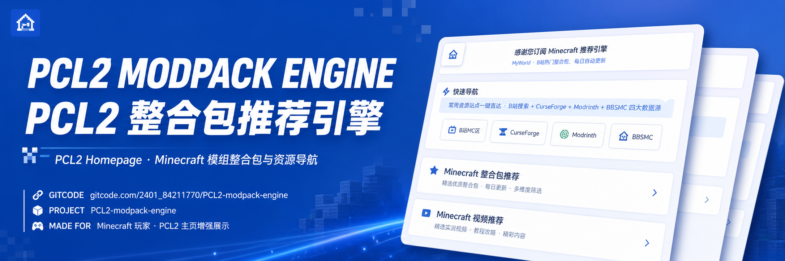

# PCL2 整合包推荐引擎



[](https://gitcode.com/2401_84211770/PCL2-modpack-engine)
[](output/version.txt)
[](LICENSE-CODE)
[](LICENSE-CONTENT)

> **聚合 B站 / BBSMC / CurseForge / Modrinth 的 Minecraft 整合包推荐主页**  
> Plain Craft Launcher 2 联网自定义主页 · 暗黑中世纪风格 · 每日自动更新

---

## 📥 联网更新地址

```
https://raw.gitcode.com/2401_84211770/PCL2-modpack-engine/raw/main/output/Custom.xaml
```

---

## 🚀 使用路径

1. 打开 **Plain Craft Launcher 2**
2. **设置** ⚙️ → **个性化** → **自定义主页**
3. 在 **「联网更新」** 区域点击 **「下载地址」**
4. 输入上方联网更新地址 → **「确定」**
5. 返回启动页即可

> 💡 详细图文教程：[安装与使用教程](docs/usage.md)

---

## ✨ 功能

| 模块 | 说明 |
|------|------|
| 🗡️ 整合包推荐 | BBSMC/CurseForge/Modrinth 热门整合包一键直达 |
| 🎬 视频推荐 | B站 MC 区热门整合包视频，点击跳转观看 |
| 👤 创作者中心 | 籽岷 · 黒山大叔 · 卡慕SaMa · Nor叔 等知名 UP 主 |
| 🔄 每日更新 | 每日 07:00 自动同步最新数据 |
| 🔍 多源聚合 | B站 / BBSMC / CurseForge / Modrinth 四源整合 |

---

## 📸 截图

| 折叠态 | 整合包展开 | 关于区 |
|:------:|:----------:|:------:|
|  |  |  |

---

## 📊 数据来源

- [B站](https://bilibili.com) — 整合包视频与 UP 主数据
- [BBSMC](https://bbsmc.net) — 中文 MC 资源下载站
- [CurseForge](https://curseforge.com/minecraft/modpacks) — 全球最大 MC 模组平台
- [Modrinth](https://modrinth.com/modpacks) — 开源 MC 整合包平台

> ⚠️ **数据仅供参考，非广告推荐**。收录不收取费用，排序基于算法综合热度，不受商业因素影响。

---

## 📋 项目文件

| 文件 | 说明 |
|------|------|
| `output/Custom.xaml` | PCL2 自定义主页（核心输出） |
| `output/version.txt` | 当前版本号 |
| `data/version.json` | 版本元数据（含更新日志） |
| `src/generator.py` | XAML 生成脚本 |
| `src/scrape_links.py` | 数据采集脚本 |
| `docs/usage.md` | 安装与使用教程 |
| `docs/maintenance.md` | 维护说明 |

---

## 📰 更新日志

查看 [CHANGELOG.md](CHANGELOG.md) 了解版本变更。

---

## 🐛 问题反馈

如发现链接失效、内容错误或有改进建议，请在 GitCode 提交 Issue：

[➡ 提交反馈](https://gitcode.com/2401_84211770/PCL2-modpack-engine/issues)

---

## 💝 致谢

- [龙腾猫跃](https://afdian.com/a/LTCat) — PCL2 启动器作者
- [Light Beacon](https://github.com/Light-Beacon/PCL2-NewsHomepage) — PCL2 主页生态开创者
- [EYicheng](https://github.com/EYicheng/PCL2-TodayHomepage) — 主页 README 结构参考
- Gen X Soft Club — 暗黑中世纪视觉风格灵感
- B站 MC 区创作者 & 社区维护者

---

## 📜 许可证

| 部分 | 范围 | 许可证 |
|------|------|--------|
| 代码 | `src/` 目录下脚本 | [MIT License](LICENSE-CODE) |
| 内容 | XAML 主页、文档、截图 | [CC BY-NC-SA 4.0](LICENSE-CONTENT) |
